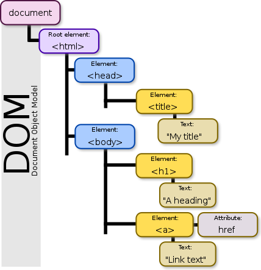

# On13-TodasEmTech-JavaScriptIII-Revisão

Esta é a 10ª semana da turma online Todas em Tech - Front-end, nesta aula do dia 16/10/2021 teremos os seguintes conteúdos:

- Revisão de JavaScript;
  - Condicionais;
  - Loops;
  - Callbacks;
  - Arrays;
  - Métodos de Array;
  - Objetos;
  - Objeto Date e seus métodos;
  - JSON;
  - DOM;

## Apresentação

### Quem é a professora Lilit?


[Lilit Bandeira](https://www.instagram.com/lilitbandeira), é uma travesti paraibana residente no Recife, Software Engineer na Sanar, desenvolvedora Fullstack, ex-aluna {reprograma} e estudante de Cinema e Audiovisual na UFPE;

#### Contatos

- E-mail: devlilitbandeira@gmail.com
- [LinkedIn](https://www.linkedin.com/in/lilitbandeira)
- [GitHub](https://github.com/lilitbandeira)

### Quem são as monitoras?


### Quem são as alunas?


## Acordos

- Enviar dúvidas no chat para as monitoras;
- Levantar a mão sempre que desejar falar, o que pode ser feito a qualquer momento;
- Manter microfones desligados sempre que alguém estiver falando;
- Manter as câmeras ligadas o máximo de tempo possível;

## Plano de aula

### 1. Revisão JavaScript

#### 1.1. Condicionais;

##### 1.1.1. If... else

A condicional `if` é uma estrutura condicional que executa a afirmação, dentro do bloco, se determinada condição for verdadeira. Se for falsa, executa as afirmações dentro de `else`. _(MDN)_ Podemos encadear vários ifs com `else if`

```js
const horario = 7; // valor esperado entre 0 e 23
```

```js
if (horario < 12) {
  console.log("dia");
} else {
  console.log("noite");
}
```

###### Reduzindo com condicional ternário

```js
horario < 12 ? console.log("dia") : console.log("noite");
```

##### 1.1.2. Switch/case

A condicional switch avalia uma expressão, combinando o valor da expressão para um cláusula `case`, e executa as instruções associadas ao case. _(MDN)_ Passamos o `break` para sair da condicional quando um case é correspondido e sua instrução executada. Caso nenhum case seja correspondido podemos usar a cláusula `default` (opcional)

```js
switch (horario) {
  case 0:
  case 1:
  case 2:
  case 3:
  case 4:
  case 5:
    console.log("madrugada")
    break
  case 6:
  case 7:
  case 8:
  case 9:
  case 10:
  case 11:
    console.log("manhã")
    break
  case 12:
  case 13:
  case 14:
  case 15:
  case 16:
  case 17:
    console.log("tarde")
    break
  case 18:
  case 19:
  case 20:
  case 21:
  case 22:
  case 23:
    console.log("noite")
    break
  default:
    console.log("horário inválido");
}
```

---

#### 1.2. Loops;

- ##### array para exemplos:

  ```js
  const numeros = [3, 2, 4, 3, 5, 1, 3, 4, 2];
  ```

- `for`

  ```js
  for (let i = 0; i < numeros.lenght; i++) {
    const dobro = numeros[i] * 2;
    console.log(dobro);
  }
  ```

- `while`

  ```js
  let i = 0;
  while (i < numeros.lenght) {
    const dobro = numeros[i] * 2;
    console.log(dobro);
    i++;
  }
  ```

- `for...of`

  ```js
  for (let numero of numeros) {
    const dobro = numero * 2;
    console.log(dobro);
  }
  ```

---

#### 1.3. Callbacks;

Uma função callback é uma função passada a outra função como parâmetro, que é então invocada dentro da função externa para completar algum tipo de rotina ou ação. _(MDN)_ A Callback é chamada no retorno da função externa.

```js
function somar(a, b) {
  return a + b;
}

function subtrair(a, b) {
  return a - b;
}

function multiplicar(a, b) {
  return a * b;
}

function dividir(a, b) {
  return a / b;
}

function calcular(a, b, callback) {
  return callback(a, b);
}

const num1 = 7;
const num2 = 2;

const somaDoisNumeros = calcular(num1, num2, somar);
const subtracaoDoisNumeros = calcular(num1, num2, subtrair);
const multiplicacaoDoisNumeros = calcular(num1, num2, multiplicar);
const divisaoDoisNumeros = calcular(num1, num2, dividir);

console.log([somaDoisNumeros]); // 9
console.log(subtracaoDoisNumeros); // 5
console.log(multiplicacaoDoisNumeros); // 14
console.log(divisaoDoisNumeros); // 3.5
```

##### Deixando a sintaxe reduzida com arrow function:

```js
const somar = (a, b) => a + b;

const subtrair = (a, b) => a - b;

const multiplicar = (a, b) => a * b;

const dividir = (a, b) => a / b;

const calcular = (a, b, callback) => callback(a, b);
```

---

#### 1.4. Arrays;

**Criando uma array:**

```js
const tipos = ["String", "Números", "Booleanos"];
const cidades = new Array("Recife", "São Paulo", "Manaus");
const cursos = "frontend backend".split(" ");
const tecnologias = Array.of("HTML", "CSS", JS);
```

**Acessando o valor de um elemento da array:**

```js
console.log(alunas[1]);
```

**Desestruturando uma array:**

```js
const [primeiro, segundo] = tipos;
console.log(primeiro);
console.log(segundo);
```

---

#### 1.5. Métodos de Array;

- ##### array para exemplos:

  ```js
  const numeros = [3, 2, 4, 3, 5, 1, 3, 4, 2];
  ```

- `find()`

  ```js
  const encontrarPrimeiro = numeros.find((element) => element == 2);
  console.log(encontrarPrimeiro); // retorno 2
  ```

- `filter()`

  ```js
  const filtrarPor = numeros.filter((element) => element == 3);
  console.log(filtrarPor); // retorno [3, 3, 3]
  ```

- `map()`

  ```js
  const executarTodos = numeros.map((element) => (element = 4));
  console.log(executarTodos); // retorn  [4, 4, 4, 4, 4, 4, 4, 4, 4]
  ```

- `forEach()`

  ```js
  const verTodos = numeros.forEach((element) => console.log(element));
  console.log(verTodos); // retorno  3\n2\n4\n3\n5\n1\n3\n4\n2
  ```

- `reduce()` -> O método reduce() uma callback que será executada para cada elemento da array, resultando num único valor de retorno, esta callback pode receber alguns parâmetros, sendo os mais comuns o `acumulador` e o `valorAtual`

  ```js
  const ReduzirPara = numeros.reduce(
    (acumulador, valorAtual) => acumulador + valorAtual
  );
  console.log(ReduzirPara); // retorno 27
  ```

- `concat()` -> retorna um novo array contendo todos os arrays ou valores passados como parâmetro. _(MDN)_

  ```js
  const arrayConcatenada = numeros.concat(1, [2, 3], "café");
  console.log(arrayConcatenada); // retorno [3, 2, 4, 3, 5, 1, 3, 4, 2, 1, 4, 5, 2, 'café']
  ```

- `push():` -> adiciona um ou mais elementos ao final de um array e retorna o novo comprimento desse array. _(MDN)_

  ```js
  const adicionaNoFinal = numeros.push(2, 3);
  console.log(adicionaNoFinal); // retorno 11
  ```

- `pop():` -> remove o último elemento de um array e retorna aquele elemento. _(MDN)_

  ```js
  const removeUltimo = numeros.pop();
  console.log(removeUltimo); // retorno 2
  ```

- `shift()` -> remove o primeiro elemento de um array e retorna esse elemento. Este método muda o tamanho do array. _(MDN)_

  ```js
  const removePrimeiro = numeros.shift();
  console.log(removeUltimo); // retorno 3
  ```

- `unshift()` -> adiciona um ou mais elementos no início de um array e retorna o número de elementos (propriedade length) atualizado. _(MDN)_

  ```js
  const adicionaNoInicio = numeros.unshift(4, 1);
  console.log(adicionaNoFinal); // retorno 11
  ```

- `slice()` -> retorna uma cópia de parte de um array a partir de um subarray criado entre as posições início e fim (fim não é necessário) de um array original. O Array original não é modificado. _(MDN)_

  ```js
  const copiaParte = numeros.slice(2, 5);
  console.log(copiaParte); //retorno [4, 3, 5]
  ```

- `splice()` -> altera o conteúdo de uma lista, adicionando novos elementos enquanto remove elementos antigos. _(MDN)_

  ```js
  const removeEAdiciona = numeros.splice(2, 2, "novo");
  console.log(removeEAdiciona); //retorno [4, 3] -> removidos
  console.log(numeros); // retorno [3, 2, 'novo', 5, 1, 3, 4, 2]
  ```

- `indexOf()` -> retorna o primeiro índice em que o elemento pode ser encontrado no array, retorna -1 caso o mesmo não esteja presente. _(MDN)_

  ```js
  const localizaElemento = numeros.indexOf(2);
  console.log(localizaElemento); // retorno 1
  ```

- `includes()` -> determina se um array contém um determinado elemento, retornando true ou false apropriadamente. _(MDN)_

  ```js
  const verificaSeExiste = numeros.includes(4);
  console.log(localizaElemento); // true
  ```

- `join()` -> junta todos os elementos de um array em uma string e retorna esta string. _(MDN)_

  ```js
  const transformaString = numeros.join("-");
  console.log(transformaString); // retorno "3, 2, 4, 3, 5, 1, 3, 4, 2"
  ```

---

#### 1.6. Objetos;

Um objeto é uma coleção de dados e/ou funcionalidades relacionadas (que geralmente consistem em diversas variáveis e funções — que são chamadas de propriedades e métodos quando estão dentro de objetos). _(MDN)_ Os objetos são formados por chave e valor

**Criando um objeto:**

```js
const aluna = {
  nome: { primeiro: "Lilit", segundo: "Bandeira" },
  idade: 32,
  cidade: "Recife",
  interesses: ["música", "animes"],
  saudacao: () => console.log("olá meninas"),
};
```

**Acessando o valor de uma propriedade ou método de objetos usando:**

1. notação de ponto - Digitando o ponto, podemos acessar todos as propriedades e métodos encapsuladas dentro do objeto

```js
console.log(aluna.nome.primeiro);
aluna.saudacao();
```

2. notação de cochetes - Parecido com a maneira que acessamos itens de um array, só que ao invés de usarmos índice (número), usamos a chaves (strings) para acessar o valor de um item

```js
console.log(aluna["nome"]["primeiro"]);
console.log(aluna["idade"]);
console.log(aluna["interesses"][0]);
```

**Desestruturando um objeto:**

```js
const { idade, saudacao } = aluna;
```

---

#### 1.7. Objeto Date e seus métodos;

- Cria uma instância JavaScript de Date que representa um único momento no tempo. Objetos Date são baseados no valor de tempo que é o número de milisegundos desde 1º de Janeiro de 1970 (UTC). _(MDN)_

- O método toLocaleDateString() retorna uma string com a representação de parte da data baseando-se no idioma. _(MDN)_ Argumentos _locales_ e _options_

```js
const hoje = new Date();

console.log(hoje); // 2021-10-16T10:56:49.693Z

const dia = hoje.getDate();
const mes = hoje.getMonth();
const ano = hoje.getFullYear();

console.log(`${dia}/${mes + 1}/${ano}`); // 16/10/2021 🤔

const dataFormatada = hoje.toLocaleDateString("pt-BR");
console.log(dataFormatada); // 16/10/2021

const options = {
  weekday: "long",
  year: "numeric",
  month: "long",
  day: "numeric",
};
const dataLonga = hoje.toLocaleDateString("pt-BR", options);
console.log(dataLonga); // sábado, 5 de setembro de 2020
```

---

#### 1.8. JSON;

- JavaScript Object Notation (JSON) é um formato baseado em texto padrão para representar dados estruturados com base na sintaxe do objeto JavaScript; _(MDN)_

- Mesmo que se assemelhe à sintaxe literal do objeto JavaScript, ele pode ser usado independentemente do JavaScript, e muitos ambientes de programação possuem a capacidade de ler (analisar) e gerar JSON; _(MDN)_

- O JSON é transmitido por uma rede cmo string, o que permite ser utilizado em uma variedade enorme de aplicações, o JavaScript possui o Objeto global `JSON`que possui métodos para converter para objeto quando queremos acessar os dados e para string quando queremos enviá-lo por rede;

- Um objeto JSON pode ser armazenado em seu próprio arquivo. _(MDN)_ (__ex.: arquivo.json__)

- __Estrutura JSON__:

```json
{
  "squadName": "Super hero squad",
  "homeTown": "Metro City",
  "formed": 2016,
  "secretBase": "Super tower",
  "active": true,
  "members": [
    {
      "name": "Molecule Man",
      "age": 29,
      "secretIdentity": "Dan Jukes",
      "powers": [
        "Radiation resistance",
        "Turning tiny",
        "Radiation blast"
      ]
    },
    {
      "name": "Madame Uppercut",
      "age": 39,
      "secretIdentity": "Jane Wilson",
      "powers": [
        "Million tonne punch",
        "Damage resistance",
        "Superhuman reflexes"
      ]
    },
    {
      "name": "Eternal Flame",
      "age": 1000000,
      "secretIdentity": "Unknown",
      "powers": [
        "Immortality",
        "Heat Immunity",
        "Inferno",
        "Teleportation",
        "Interdimensional travel"
      ]
    }
  ]
}
``` 
_(fonte: MDN)_

- __Acessando JSON__:

```js
  console.log(superHeroes.homeTown)
  console.log(superHeroes['active'])
  console.log(superHeroes['members'][1]['powers'][2])
```

- __Matrizes como JSON__:

```json
[
  {
    "name": "Molecule Man",
    "age": 29,
    "secretIdentity": "Dan Jukes",
    "powers": [
      "Radiation resistance",
      "Turning tiny",
      "Radiation blast"
    ]
  },
  {
    "name": "Madame Uppercut",
    "age": 39,
    "secretIdentity": "Jane Wilson",
    "powers": [
      "Million tonne punch",
      "Damage resistance",
      "Superhuman reflexes"
    ]
  }
]
```
- __Acessando JSON (matrizes)__:

```js
  console.log(heroes[0]["powers"][0])
```

- __Importante__:

  - JSON contém apenas propriedades, sem métodos;
  - JSON só aceita aspas duplas;
  - JSON não aceita chaves/propriedades sem aspas como objetos JS, toda string precisa usar aspas;

---

#### 1.9. DOM



DOM é uma sigla que significa Document Object Model. Quando a página é carregada o browser cria um objeto que representa os elementos da página a partir do HTML. A forma mais fácil de acessar e manipular o DOM é usando JavaScript.

- Document: representa o documento HTML
- Element: são todas as tags que estão no arquivo HTML e se transformam em elementos da árvore DOM
- Text: é o conteúdo de texto que vai entre os elementos (tags).
- Attribute: são os todos atributos para um nó específico. No caso, o attribute href="http:// instagram .com/lilitbandeira" está associado ao elemento, outros exemplos de atributos são o class, o src, o id, entre outros.

O DOM é a representação do objeto do documento HTML e atua como uma interface de programação que permite a manipulação de sua estrutura com o JavaScript ou outras linguagens. Podemos manipular o DOM para realizar alterações na estrutura do HTML, alterar estilos, modificar conteúdos e adicionar diversos eventos.

Podemos manipular o DOM para realizar alterações na estrutura do HTML, alterar estilos, modificar conteúdos e adicionar diversos eventos.

##### Métodos de manipulação DOM

O DOM possui muitos métodos, são eles que fazem a ligação entre os nós (elementos) e os evento.
Seguem alguns dos principais métodos, para a lista completa acesse a [documentação.](https://developer.mozilla.org/en-US/docs/Web/API/Document)

- `getElementById()` -> Retorna o elemento que possui o id passado como argumento;
- `getElementsByClassName()` -> Retorna uma coleção de todos os elementos que possuem a classe passada como argumento;
- `getElementsByTagName()` -> Retorna uma coleção de todos elementos que possuem a tag name informada
- `querySelector()` -> Retorna o primeiro elemento do DOM que possui a .class, #id ou tag passada como argumento;
- `querySelectorAll()` -> Retorna todos os elementos do DOM que possuem a .class, #id ou tag passada como argumento;
- `createElement()` -> Cria um elemento na página;
- `createAttribute()` -> Cria um atributo na página;
- `appendChild()` -> Insere um elemento filho ao final do elemento mãe;
- `removeChild()` -> Remove um elemento filho e retorna o elemento removido;
- `parentNode()` -> Retorna a mãe de um elemento.

##### Propriedades de manipulação DOM

- `innerText` -> define ou obtém o conteúdo textual "renderizado" de um nó e seus descendentes;
- `innerHTML` -> define ou obtém a sintaxe HTML contida no elemento;
- `value` -> define ou retorna o valor do atributo value de um campo de texto.
- `classList` -> propriedade somente leitura que retorna uma coleção com as classes do elemento;
  - `add()` -> adiciona uma classe ao elemento;
  - `remove()` -> remove uma classe do elemento;
  - `toggle()` -> adiciona uma classe ao elemento caso a classe não exista, caso exista a remove;
  - `contains()` -> Retorna um valor booleano, indicando se um elemento tem o nome da classe especificada;
- `style` -> Acrescenta/modifica um estilo ao elemento;

##### Eventos

Um eventos é um conjunto de ações que são realizadas em um determinado elemento da página web, seja ele um texto, uma imagem, ou uma div, por exemplo. Grande parte dos eventos nascem na interação da usuária com a aplicação, como:

| Evento      | Descrição                                                    |
| ----------- | ------------------------------------------------------------ |
| onBlur      | remove o foco do elemento                                    |
| onChange    | muda o valor do elemento                                     |
| onClick     | o elemento é clicado pela usuária                            |
| onFocus     | o elemento é focado                                          |
| onKeyPress  | a usuária pressiona uma tecla sobre o elemento               |
| onKeyUp     | define ação quando a usuária libera a tecla é pressionada    |
| onLoad      | carrega o elemento por completo                              |
| onMouseOver | define ação quando a usuária passa o mouse sobre o elemento  |
| onMouseOut  | define ação quando a usuária retira o mouse sobre o elemento |
| onSubmit    | define ação ao enviar um formulário                          |

Para manipular evento externo podemos usar Event listener que adiciona ou remove um evento sobre qualquer elemento. O Event Listener disponibiliza duas funções principais, são elas:

- **addEvent** - Adiciona uma função que será disparada quando ocorrer determinado evento no objeto.
- **removeEvent** - Remove um listener previamente adicionado em um objeto e retorna true em caso de sucesso.

  ```
  elemento.addEventListener('click', function (evento) {
    //ação a ser executada no clique do elemento
    console.log(evento);
  });
  ```

Usamos o método preventDefault() para cancelar a ação padrão que pertence a um determinado evento.

---

### 2. Para praticar na aula

#### 2.1. Vamos resolver os desafios do projeto da semana passada revisando os conceitos?

##### - Desafio 1: 

- Criar animação para quando a usuária tentar criar uma tarefa com uma string vazia ou somente com espaços ao invés de somente um alert;

##### - Desafio 2: 

- Criar uma função que mude o texto do botão Marcar/Desmarcar todos: Se houver pelo menos uma tarefa desmarcada (Marcar todos) e caso todas sejam desmarcadas manualmente (Desmarcar todos)

##### - Desafio extra: 

- Criar container modelo que ocupe o espaço da lista de tarefas quando não houver nenhuma tarefa criada e fique oculta quando tarefas forem adicionadas;


#### 2.2. Vamos consumir um arquivo Json?

- Devemos criar uma página (usando HTML e CSS) e popular os campos corretamente com os dados do objeto JSON (usando JavaScript), o objeto já está no arquivo script.js na pasta pratica com todos os detalhes sobre o exercício;

### 3. Desafio da Semana

- Devemos criar uma página (usando HTML e CSS) e popular os campos corretamente com os dados do objeto JSON (usando JavaScript), o objeto já está no arquivo script.js na pasta exercício com todos os detalhes sobre no desafio;

## Referências

| Conteúdo          | Fonte | Link                                                                                                     |
| ----------------- | ----- | -------------------------------------------------------------------------------------------------------- |
| Callbacks         | MDN   | https://developer.mozilla.org/pt-BR/docs/Glossario/Callback_function                                     |
| If..else          | MDN   | https://developer.mozilla.org/pt-BR/docs/Web/JavaScript/Reference/Statements/if...else                   |
| Switch            | MDN   | https://developer.mozilla.org/pt-BR/docs/Web/JavaScript/Reference/Statements/switch                      |
| Ternário          | MDN   | https://developer.mozilla.org/pt-BR/docs/Web/JavaScript/Reference/Operators/Conditional_Operator         |
| While             | MDN   | https://developer.mozilla.org/pt-BR/docs/Web/JavaScript/Reference/Statements/while                       |
| For               | MDN   | https://developer.mozilla.org/pt-BR/docs/Web/JavaScript/Reference/Statements/for                         |
| For...of          | MDN   | https://developer.mozilla.org/pt-BR/docs/Web/JavaScript/Reference/Statements/for...of                    |
| Arrays            | MDN   | https://developer.mozilla.org/pt-BR/docs/Learn/JavaScript/First_steps/Arrays                             |
| find()            | MDN   | https://developer.mozilla.org/pt-BR/docs/Web/JavaScript/Reference/Global_Objects/Array/find              |
| filter()          | MDN   | https://developer.mozilla.org/pt-BR/docs/Web/JavaScript/Reference/Global_Objects/Array/filter            |
| map()             | MDN   | https://developer.mozilla.org/pt-BR/docs/Web/JavaScript/Reference/Global_Objects/Array/map               |
| forEach()         | MDN   | https://developer.mozilla.org/pt-BR/docs/Web/JavaScript/Reference/Global_Objects/Array/forEach           |
| Reduce()          | MDN   | https://developer.mozilla.org/pt-BR/docs/Web/JavaScript/Reference/Global_Objects/Array/reduce            |
| concat()          | MDN   | https://developer.mozilla.org/pt-BR/docs/Web/JavaScript/Reference/Global_Objects/Array/concat            |
| Objetos           | MDN   | https://developer.mozilla.org/pt-BR/docs/Learn/JavaScript/Objects                                        |
| Objetos           | MDN   | https://developer.mozilla.org/pt-BR/docs/Learn/JavaScript/Objects/Basics                                 |
| Desestruturação   | MDN   | https://developer.mozilla.org/pt-BR/docs/Web/JavaScript/Reference/Operators/Destructuring_assignment     |
| Date              | MDN   | https://developer.mozilla.org/pt-BR/docs/Web/JavaScript/Reference/Global_Objects/Date                    |
| toLocalDateString | MDN   | https://developer.mozilla.org/pt-BR/docs/Web/JavaScript/Reference/Global_Objects/Date/toLocaleDateString |
| JSON              | MDN   | https://developer.mozilla.org/pt-BR/docs/Learn/JavaScript/Objects/JSON                                   |
| DOM               | MDN   | https://developer.mozilla.org/en-US/docs/Web/API/Document_Object_Model                                   |
| Eventos           | MDN   | https://developer.mozilla.org/pt-BR/docs/Learn/JavaScript/Building_blocks/Events                         |

## Agradecimentos

- [Professota Barbara Aguilar](https://www.linkedin.com/in/barbara-aguilar/), de quem peguei parte do conteúdo da revisão no repositório de JavascriptI da turma 8;
- [Professora Anna Flávia](https://www.linkedin.com/in/anna-flávia-2691a754/), de quem também peguei parte do conteúdo da revisão no repositório de Revisão da turma 6;
